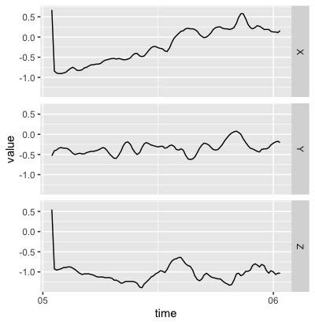

<!-- README.md is generated from README.Rmd. Please edit that file -->

# bis620.2022

<!-- badges: start -->

[](https://github.com/HankkaMark/BIS620package/actions/workflows/R-CMD-check.yaml)
[](https://github.com/HankkaMark/BIS620package/actions/workflows/lint.yaml)
[](https://github.com/HankkaMark/BIS620package/actions/workflows/test-coverage.yaml)
[](https://app.codecov.io/gh/HankkaMark/BIS620package?branch=master)
<!-- badges: end -->

The goal of bis620.2022 is to …

## Installation

You can install the development version of bis620.2022 from
[GitHub](https://github.com/) with:

``` r
# install.packages("devtools")
devtools::install_github("HankkaMark/bis620.2022")
```

## Example

This is a basic example which shows you how to solve a common problem:

``` r
library(bis620.2022)
## basic example code
data(ukb_accel)
p <-  accel_plot(ukb_accel[1:100, ])
p
```


You can also embed plots, for example:


In that case, don’t forget to commit and push the resulting figure
files, so they display on GitHub and CRAN.
